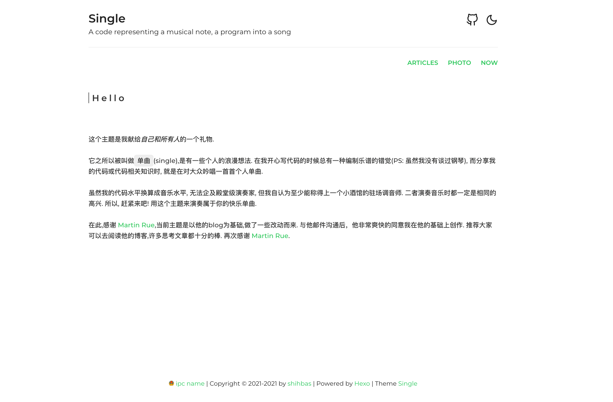
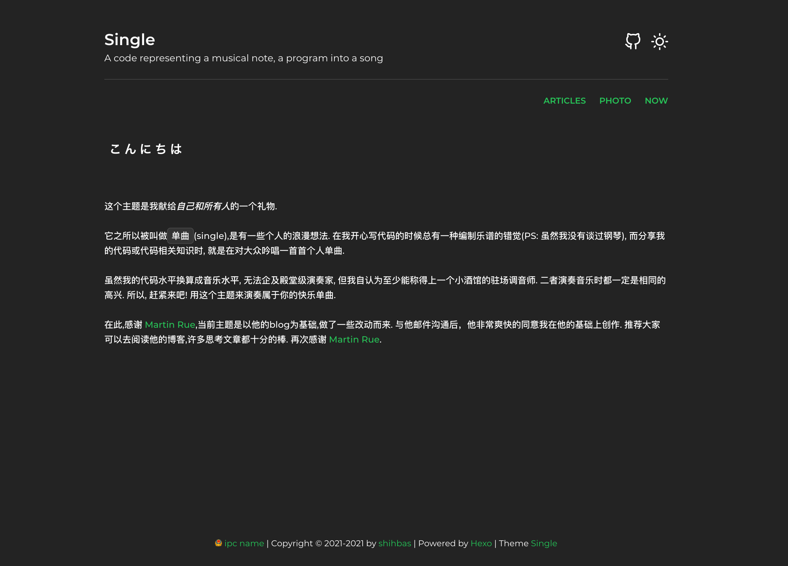
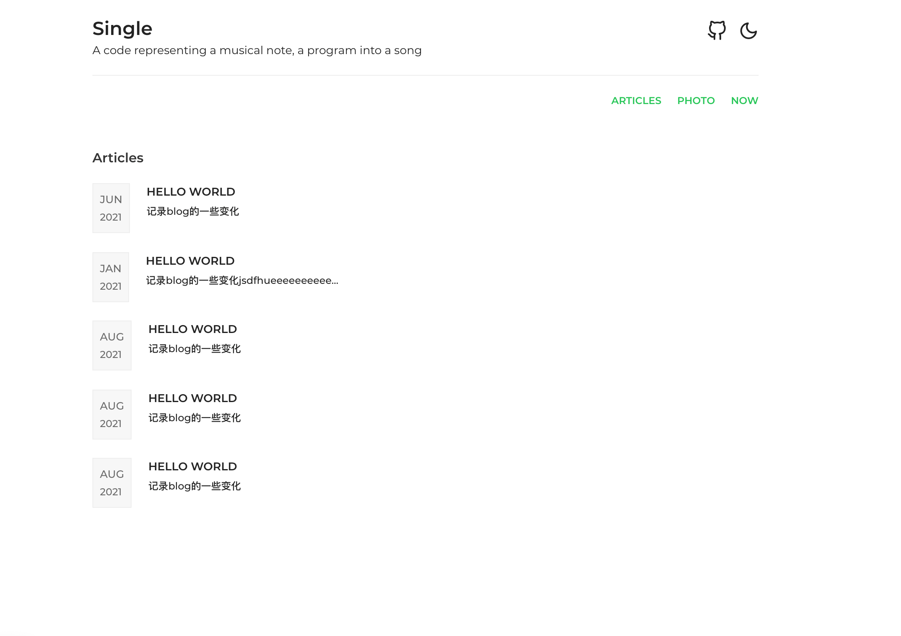
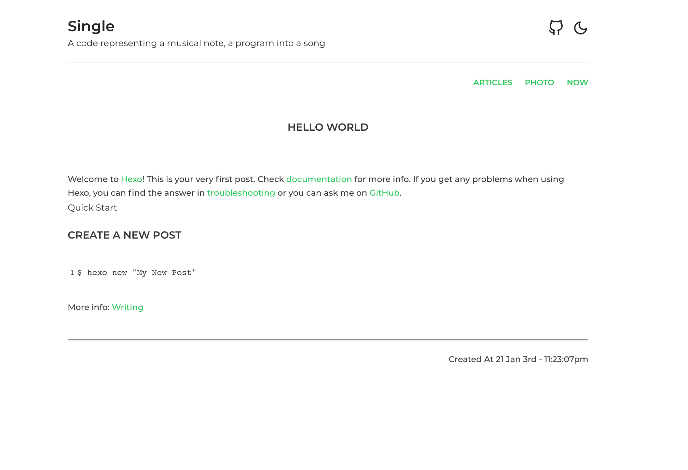
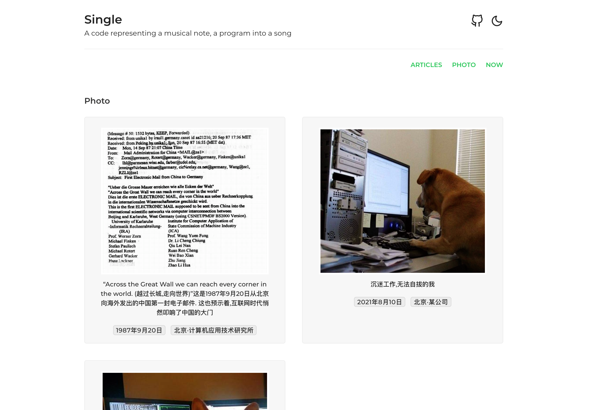
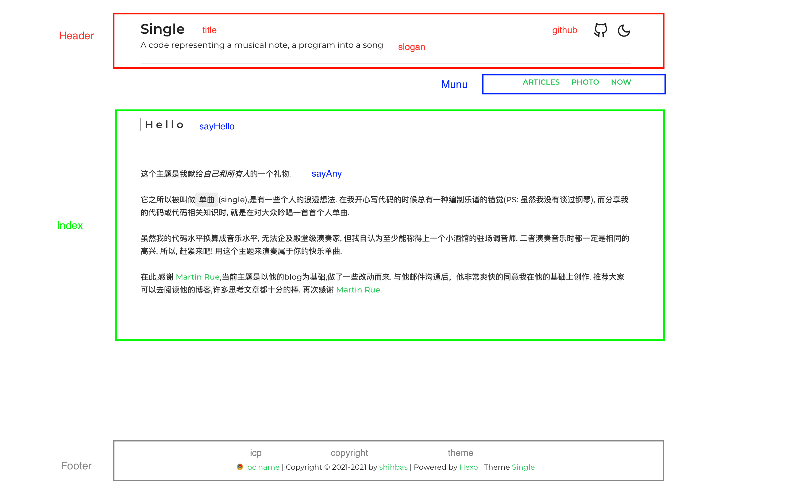

# hexo theme -- single

## 1. 主题展示

#### 首页



> 可点击🌛图标切换到暗色模式

#### 暗色模式



> 可点击☀️图标切换到亮色模式

#### 文章列表页



#### 文章详情页



#### 相册页




### Now Page

与文章详情页相同，相关配置见【配置说明 -- Menu】


## 2. 配置说明

> 当前只支持在`theme/_config.yml` 中配置该主题的参数



#### Header 配置

> 上图中`红色`框部分属于 Header 所能做的配置

```

## 示例

Header:
  title: "Single"
  slogan: "A code representing a musical note, a program into a song"
  github:
    enable: true
    url: "https://github.com/shihbas/single"

```

可将 `Header.github.enable` 配置为 *False*, 就不会显示 gitHub 图标了

#### Menu 配置

> 上图`蓝色`部分属于 Menu 配置

```

## 示例

Menu:
  Articles:
    url: /articles/
    name: Articles
  Photo:
    url: /photo/
    name: Photo
  Now:
    url: /now/
    name: Now
  AnyLink:
    url: http://www.anylink.com
    name: AnyLink

```

- Articles 与 Photo 是内置的两个模块，若想要启用它们除了在配置文件中增加以上`示例`中 **Articles** 和 **Photo** 的配置外，还需要在`source/` 下创建 `articles` 和 `photo` 文件夹，并在文件夹中增加一个 `index.md` 文件.各个文件内容如下

> source/articles/index.md 的内容

```

---
title: articles
type: "articles"
layout: "articles"
---

```

> source/photo/index.md 的内容

```

---
title: photo
type: "photo"
layout: "photo"
---

```

- Now 这样的配置与 `articles` 和 `photo` 也是一样的，需要单独去添加一个 `source/now/index.md`, 不同的是它的内容不固定，就是一篇普通hexo文章格式即可，当点击Now时，就会显示 `source/now/index.md` 中的文章内容.

- AnyLink 示例即表明可以定义任意外连接作为跳转的目的地。

#### Index 配置

> 上图`绿色`部分属于 Index 配置

```

## 示例

Index:
  sayHello: true
  sayAny: " any markdown string"

```

- sayHello: 是否在首页打开`动态多语言打招呼`功能
- sayAny: 支持 markdown 格式的字符串

#### Footer 配置

> 上图`灰色`部分属于 Footer 配置

```

## 示例

Footer:
  icp:
    enable: true
    text: "ipc name"
    url: "http://www.ipc.url"
  copyright:
    enable: true
    start: 2021
    end: 2021
    source:
      text: "shihbas"
      url: "https://github.com/shihbas"
  theme:
    isShowHexo: true
    isShowSingle: true

```

用于配置底部信息，包括备案(ipc), 版权(copyright)以及所用主题(theme). 该底部信息只会在首页展示(我很讨厌每一页底部都有这些信息)

#### Photo:

> 配置Photo, 我很喜欢这个功能，若你觉得没有用，可以在配置Menu时删除Photo就看不到它了

```

## 示例以及必要说明

Photo:
  p1:  ## `图片id，以字母开头的任意字符串即可, 多张图片之间不要用相同的图片id`
    image: "/assets/images/china_first_email.jpeg"
    name: "中国第一封电子邮件"
    description: "“Across the Great Wall we can reach every corner in the world. (越过长城,走向世界)”这是1987年9月20日从北京向海外发出的中国第一封电子邮件. 这也预示着,互联网时代悄然叩响了中国的大门"
    time: "1987年9月20日"
    place: "北京·计算机应用技术研究所"

```

## 3. Other

在此,感谢 [Martin Rue](https://martinrue.com/),当前主题是以他的blog为基础,做了一些改动而来. 与他邮件沟通后，他非常爽快的同意我在他的基础上创作. 推荐大家可以去阅读他的博客,许多思考文章都十分的棒. 

再次感谢 [Martin Rue](https://martinrue.com/). 
